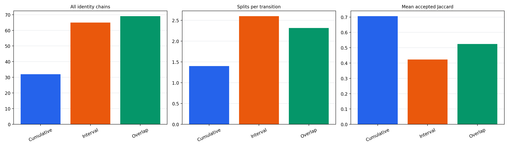
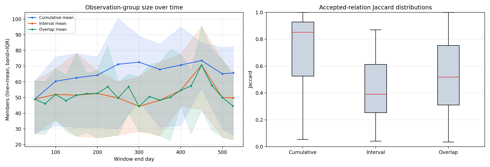
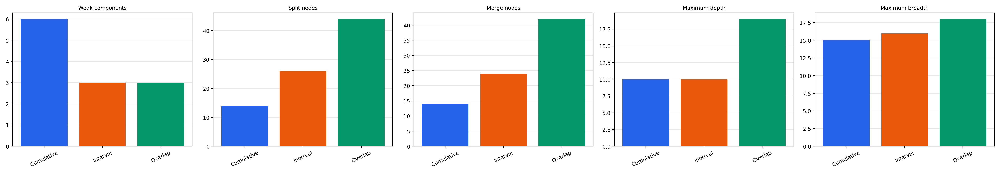
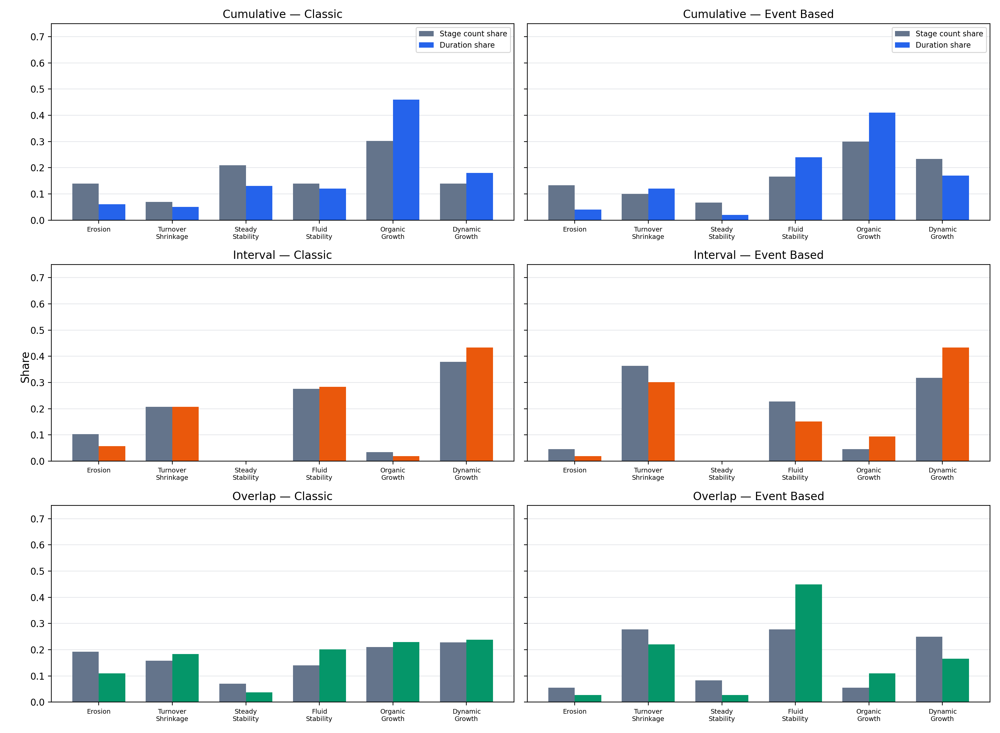
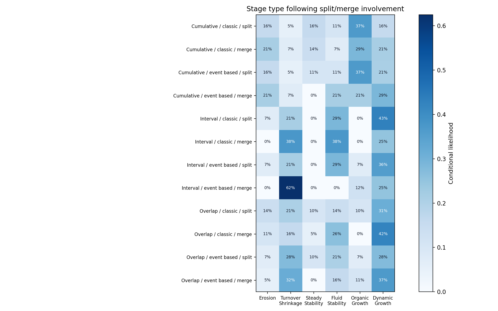

# Comparison of cumulative, interval, and overlap approaches

## Scope and comparability

All outputs use the same 526-day dataset. Cumulative and interval use 11 snapshots with 50-day steps. Overlap uses 20 snapshots with 50-day windows and a 25-day stride. Raw totals therefore reflect both approach behavior and observation frequency. Normalized rates and proportions are the primary comparison measures.

Accepted lineage relations satisfy prospective stability >= 0.4 or retrospective stability >= 0.4. Every detected community at a snapshot is an observation node. Identity chains include final and intermediate/dead chains.

## Dimension A: dynamic-group and event information

| approach | snapshot_count | observation_group_count | all_identity_chain_count | final_group_count | mean_observation_group_size | split_event_count | merge_event_count | split_events_per_transition | merge_events_per_transition | mean_accepted_jaccard | mean_inherited_jaccard |
| --- | --- | --- | --- | --- | --- | --- | --- | --- | --- | --- | --- |
| cumulative | 11 | 147 | 32 | 15 | 65.429 | 14 | 14 | 1.400 | 1.400 | 0.705 | 0.843 |
| interval | 11 | 159 | 65 | 15 | 51.491 | 26 | 24 | 2.600 | 2.400 | 0.423 | 0.575 |
| overlap | 20 | 289 | 69 | 18 | 51.664 | 44 | 42 | 2.316 | 2.211 | 0.524 | 0.655 |

The full table is `dimension_a_summary.csv`. Final-group event involvement counts can count an event once for each participating final group, matching the earlier project table.

## Dimension B: complete lineage-network structure

| approach | observation_nodes | accepted_edges | weakly_connected_components | split_nodes | merge_nodes | start_snapshot_nodes | end_snapshot_nodes | max_depth_edges | mean_component_depth_edges | max_snapshot_breadth | mean_observation_size |
| --- | --- | --- | --- | --- | --- | --- | --- | --- | --- | --- | --- |
| cumulative | 147 | 147 | 6 | 14 | 14 | 15 | 15 | 10 | 10.000 | 15 | 65.429 |
| interval | 159 | 167 | 3 | 26 | 24 | 15 | 15 | 10 | 6.667 | 16 | 51.491 |
| overlap | 289 | 317 | 3 | 44 | 42 | 15 | 18 | 19 | 12.667 | 18 | 51.664 |

Each approach has a complete PNG/PDF network. Node x is snapshot index and node y is a deterministic component/layer coordinate. Nodes show local internal IDs; terminal nodes append their final label or `dead`. Red edges touch a structural split or merge. Exact coordinates and attributes are in `network_nodes.csv` and `network_edges.csv`.

## Dimension C: classic versus event-based stages

| approach | method | analyzed_group_count | stage_count | mean_stages_per_group | mean_stage_length_snapshots | total_transition_duration |
| --- | --- | --- | --- | --- | --- | --- |
| cumulative | classic | 14 | 43 | 3.071 | 3.326 | 100 |
| cumulative | event_based | 14 | 30 | 2.143 | 4.333 | 100 |
| interval | classic | 12 | 29 | 2.417 | 2.828 | 53 |
| interval | event_based | 12 | 22 | 1.833 | 3.409 | 53 |
| overlap | classic | 14 | 57 | 4.071 | 2.912 | 109 |
| overlap | event_based | 14 | 36 | 2.571 | 4.028 | 109 |

| approach | groups_compared | stage_type_agreement_rate | classic_internal_boundary_count | event_internal_boundary_count | shared_boundary_count | boundary_jaccard |
| --- | --- | --- | --- | --- | --- | --- |
| cumulative | 14 | 0.760 | 29 | 16 | 14 | 0.452 |
| interval | 12 | 0.660 | 17 | 10 | 6 | 0.286 |
| overlap | 14 | 0.495 | 43 | 22 | 15 | 0.300 |

Stage count share and transition-duration share are separate. `count_duration_index` is their equal-weight descriptive average. Duration uses `t_end - t_start`, so shared boundary snapshots are not double-counted.

### Split/merge relationships with stages

| approach | method | event_type | event_group_involvement_count | internal_event_group_involvement_count | internal_stage_boundary_rate | post_stage_available_count | post_stage_likelihood | stage_type_change_rate | event_type_post_stage_cramers_v |
| --- | --- | --- | --- | --- | --- | --- | --- | --- | --- |
| cumulative | classic | merge | 15 | 12 | 0.833 | 14 | 0.214 | 0.667 | 0.136 |
| cumulative | classic | split | 20 | 11 | 0.818 | 19 | 0.158 | 0.727 | 0.136 |
| cumulative | event_based | merge | 15 | 12 | 1.000 | 14 | 0.214 | 0.750 | 0.307 |
| cumulative | event_based | split | 20 | 11 | 1.000 | 19 | 0.158 | 0.909 | 0.307 |
| interval | classic | merge | 11 | 6 | 0.667 | 8 | 0.000 | 0.667 | 0.272 |
| interval | classic | split | 16 | 5 | 0.400 | 14 | 0.071 | 0.400 | 0.272 |
| interval | event_based | merge | 11 | 6 | 1.000 | 8 | 0.000 | 0.833 | 0.503 |
| interval | event_based | split | 16 | 5 | 1.000 | 14 | 0.071 | 0.800 | 0.503 |
| overlap | classic | merge | 21 | 16 | 0.562 | 19 | 0.105 | 0.562 | 0.286 |
| overlap | classic | split | 33 | 16 | 0.688 | 29 | 0.138 | 0.688 | 0.286 |
| overlap | event_based | merge | 21 | 16 | 1.000 | 19 | 0.053 | 0.812 | 0.238 |
| overlap | event_based | split | 33 | 16 | 1.000 | 29 | 0.069 | 0.688 | 0.238 |

`post_stage_likelihood` is the proportion of event/group involvements whose first valid transition after the event has the listed stage type. Final-snapshot cases have no post-event transition and are excluded from that denominator. `internal_stage_boundary_rate` considers only events with valid stages on both sides. Event-based segmentation uses every such internal split/merge as a boundary. The classic rate shows how often those same events coincide with independently detected size-based boundaries. Cramer's V measures association, not causation.

## Findings and recommendation

- **Cumulative gives the strongest apparent continuity but has the most historical inertia.** Its mean accepted Jaccard is 0.705, versus 0.423 for interval and 0.524 for overlap. It also has the largest mean observation group size and the fewest split/merge events per transition. Because every snapshot retains all previous edges, this stability partly reflects construction rather than only social persistence.
- **Interval is the most fragmented and volatile.** It produces 65 identity chains, has the lowest accepted and inherited Jaccard, and has the highest split and merge rates per transition. It responds to change but loses continuity at hard 50-day boundaries.
- **Overlap is the middle ground.** Its similarity and normalized split/merge rates fall between cumulative and interval. It retains the local 50-day horizon while reducing boundary discontinuity and provides 20 observation points. Its large component and 19-edge maximum depth show that it preserves long lineages without cumulative memory.
- Event-based stages are fewer and longer than classic stages for all approaches. Classic/event label agreement is 76.0% for cumulative, 66.0% for interval, and 49.5% for overlap. The lower overlap agreement means event boundaries capture different structure from size-only turning points; it is not a classifier mismatch.
- Split and merge events do not deterministically imply erosion. The erosion likelihoods are conditional descriptive rates and vary by approach/method. Event type alone has weak-to-moderate association with the following stage in the current sample, so events should remain boundary evidence rather than direct stage labels.

**Recommendation: continue with the overlap approach.** It offers the best balance of temporal continuity, sensitivity to change, and temporal resolution. Keep cumulative as a high-continuity reference and interval as a volatility reference. Before treating the choice as final, run the planned overlap sensitivity analysis at 20 and 50 snapshots and check whether normalized event rates, component structure, and stage distributions remain stable.

## Output guide

- `dimension_a_summary.csv`: group, event, size, lifespan, and similarity measures.
- `dimension_b_network_summary.csv`: lineage-network structure.
- `network_nodes.csv`: all node attributes and x/y coordinates.
- `network_edges.csv`: accepted lineage relations and structural edge types.
- `dimension_c_stage_method_summary.csv`: stage totals and lengths.
- `dimension_c_stage_type_distribution.csv`: count, duration, prevalence, and combined shares.
- `dimension_c_classic_event_comparison.csv`: boundary and label agreement.
- `dimension_c_event_stage_associations.csv`: event/group/method details.
- `dimension_c_event_stage_summary.csv`: event-to-stage likelihoods and Cramer's V.

## Interpretation rule

Use normalized rates and structural proportions when choosing an approach. Use raw totals to understand workload and graph scale. Do not rank the approaches solely by group or event totals because overlap currently has a finer temporal stride.
