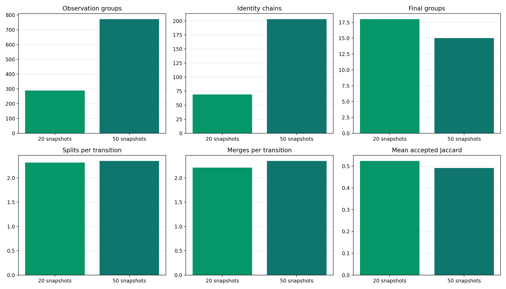
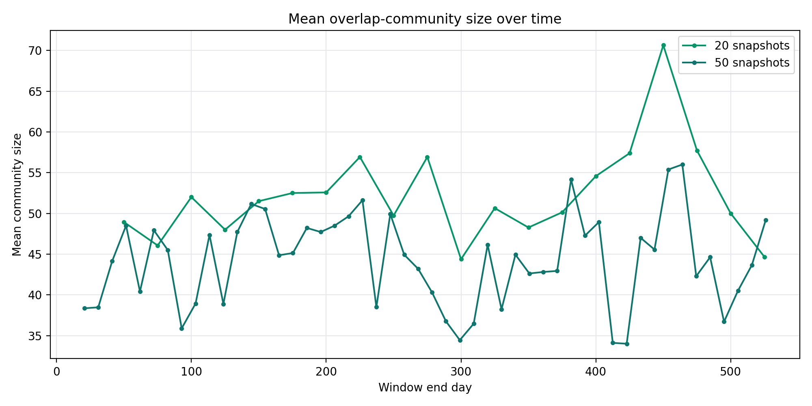
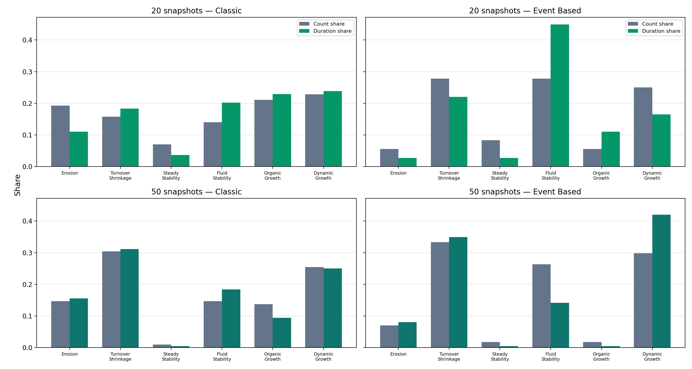

# Overlap snapshot sensitivity: 20 versus 50 snapshots

## Configuration

Both runs cover the same 526-day dataset and use 50% overlap, Louvain resolution 1.0, seed 42, minimum community size 3, and directional stability threshold 0.4. The 20-snapshot run uses exact 50-day windows with a 25-day stride and is identical to the overlap baseline in `outputs/approach_comparison`. The 50-snapshot run solves its window width from the requested count so that 50 half-overlapping windows cover the full period.

| Metric | 20 snapshots | 50 snapshots |
| --- | ---: | ---: |
| Mean window width (days) | 50.00 | 20.63 |
| Mean stride (days) | 25.00 | 10.31 |
| Observation groups | 289 | 772 |
| Identity chains | 69 | 203 |
| Final groups | 18 | 15 |
| Splits per transition | 2.316 | 2.347 |
| Merges per transition | 2.211 | 2.347 |
| Mean accepted Jaccard | 0.524 | 0.491 |
| Weakly connected components | 3 | 6 |
| Maximum lineage depth | 19 | 49 |
| Classic stages | 57 | 102 |
| Event-based stages | 36 | 57 |
| Classic/event label agreement | 49.5% | 51.4% |

## Interpretation

The 50-snapshot run is not simply a larger copy of the 20-snapshot run. Its windows are shorter, so each snapshot contains less interaction evidence. Raw group, event, and stage counts naturally increase with observation frequency. Rates per transition, Jaccard similarity, final-group count, component structure, and stage shares are therefore the main sensitivity indicators.

### Stable findings

- Final groups remain nearly unchanged: 18 at 20 snapshots and 15 at 50.
- Splits per transition change from 2.316 to 2.347; merges change from 2.211 to 2.347.
- Mean accepted Jaccard changes only from 0.524 to 0.491.
- Classic/event stage-label agreement remains close: 49.5% versus 51.4%.

These results indicate that the overlap approach's normalized event activity and final-group count are reasonably robust to the finer resolution.

### Resolution-sensitive findings

- Mean observation-group size falls from 51.7 to 43.7, because a 20.63-day window contains less interaction evidence than a 50.00-day window.
- Identity chains increase from 69 to 203, while dead chains increase from 51 to 188. This is substantial additional fragmentation rather than only additional temporal detail.
- Event-based stage composition shifts. The turnover-shrinkage share of event-based stages moves from 27.8% to 33.3%, organic growth from 5.6% to 1.8%, and steady stability from 8.3% to 1.8%. Stage conclusions are therefore not resolution-invariant.
- Classic/event boundary Jaccard changes from 0.300 to 0.290, so agreement about exact change points is largely unaffected by resolution.

## Recommendation

Keep **20-snapshot overlap as the primary working configuration**. It retains the overlap approach's continuity benefits while providing substantially more interaction evidence per snapshot and fewer fragmented/dead chains. Keep the 50-snapshot run as a fine-grained sensitivity view for locating short-lived changes, but do not mix its raw counts or stage distribution directly with the 20-snapshot results.

The detailed values and percentage changes are in `comparison/resolution_summary.csv` and `comparison/resolution_changes.csv`. Full pipeline outputs are preserved under `n20/` and `n50/`. Each configuration also includes its complete lineage-network PNG/PDF and node/edge coordinate CSVs.
